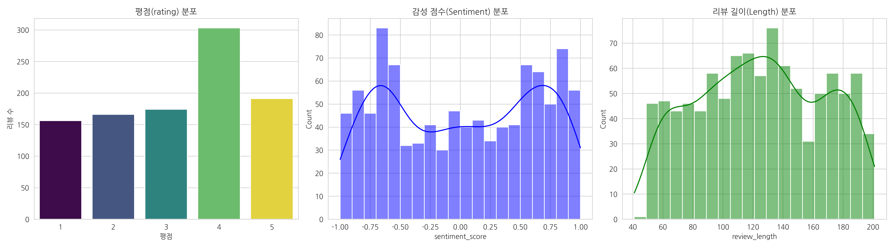
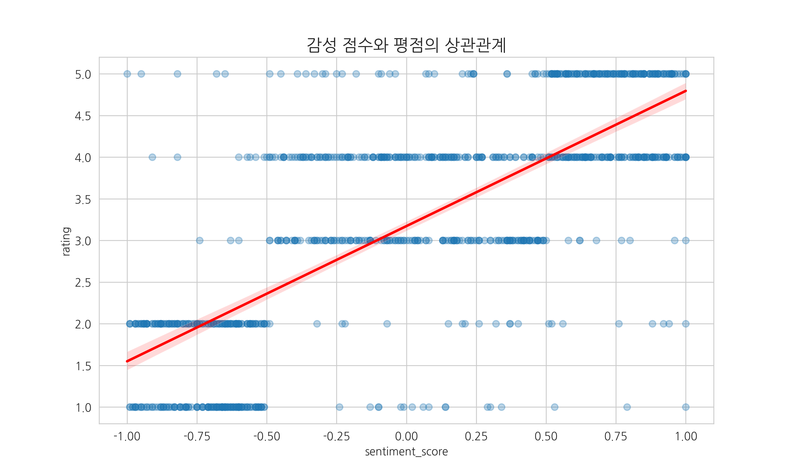
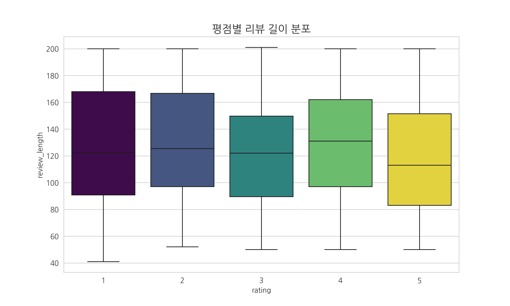
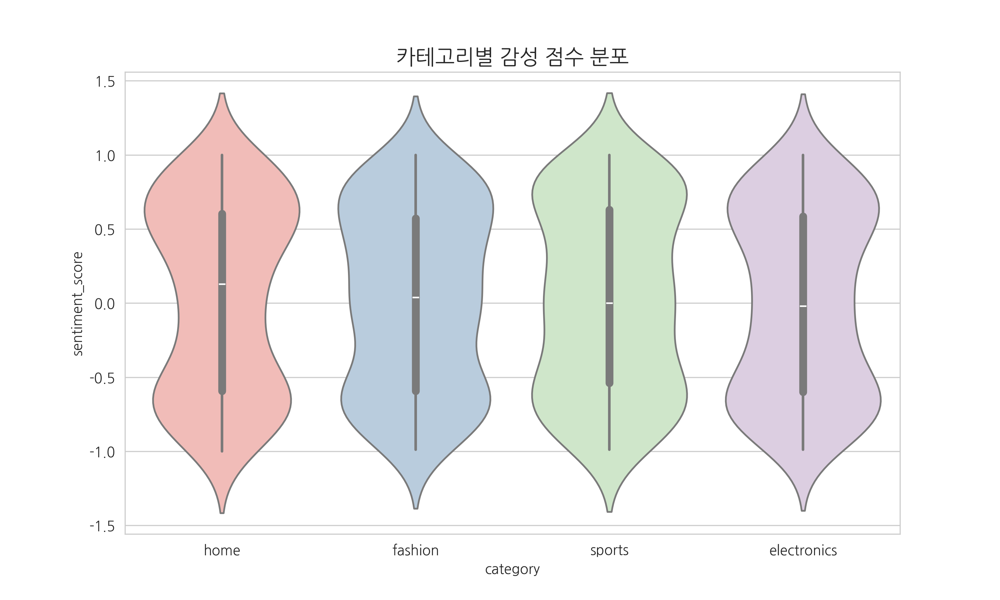

# 고객 리뷰 데이터 AI 분석 인사이트 리포트

> 본 리포트는 자동화된 Python 스크립트에 의해 생성되었습니다.

## 1. 데이터 개요 및 기술 통계
- **분석 일자**: 2026-01-14
- **원본 데이터**: 총 1000건
- **전처리 결과**: 결측치 10건 제거 후 총 990건 확보
  - **결측 발생 속성**: review_text, sentiment_score
  > *[처리 사유] 리뷰 텍스트나 평점은 고객의 고유한 주관적 경험 데이터입니다. 이를 평균값이나 임의의 값으로 대체(Imputation)할 경우, 감성 분석 모델에 거짓 정보(Noise)를 학습시키게 되어 분석 신뢰도를 치명적으로 저하시킵니다. 따라서 데이터 무결성 확보를 위해 해당 결측치를 제거하였습니다.*

### [데이터 분포 시각화 및 이상치 탐지]

**[분포 해석]**
- **평점(Rating)**: 막대그래프를 통해 특정 점수에 데이터가 편향(Imbalance)되어 있는지 확인합니다.
- **감성 점수(Sentiment)**: 히스토그램과 밀도 곡선(KDE)을 통해 긍정/부정의 전반적인 경향을 파악합니다.
- **리뷰 길이(Length)**: 데이터의 길이 분포를 확인하여, 극단적으로 긴 이상치(Outlier) 존재 여부를 식별합니다.

### [주요 변수 기초 통계량]
> **[변수 정의]**
> - **rating**: 고객이 부여한 평점 (1~5점 척도, 정수형)
> - **sentiment_score**: 리뷰 텍스트의 감성 분석 결과 (-1:부정 ~ +1:긍정, 실수형)
> - **review_length**: 리뷰 텍스트의 문자 길이 (글자 수, 정수형)

| 변수명 | 평균(Mean) | 표준편차(Std) | 최소(Min) | 중앙값(50%) | 최대(Max) |
| :--- | :---: | :---: | :---: | :---: | :---: |
| rating | 3.21 | 1.35 | 1.00 | 3.00 | 5.00 |
| sentiment_score | 0.02 | 0.62 | -1.00 | 0.03 | 1.00 |
| review_length | 124.81 | 41.72 | 41.00 | 125.50 | 201.00 |

> **[참고: 통계 지표 해석 가이드]**
- **mean (평균)**: 데이터의 중심 경향을 나타냅니다.
- **std (표준편차)**: 데이터가 평균을 중심으로 얼마나 퍼져 있는지 보여줍니다. (값이 클수록 데이터 분포가 넓음)
- **50% (중앙값)**: 데이터를 크기순으로 나열했을 때 정중앙에 위치한 값으로, 이상치(Outlier)의 영향을 덜 받습니다.

---

## Q1. sentiment_score가 높을 수록 평점이 높은가?

**[그래프 기반 해석]**
- 회귀선(붉은색)이 우상향하는 경향을 보이며, 감성 점수와 평점 간의 뚜렷한 **양의 상관관계**가 관찰됩니다.
- 특히 감성 점수가 0.5 이상인 구간에서 고평점(4~5점)의 밀도가 높습니다.

**[Insight 3줄 요약]**
1. **[결론]** 감성 점수가 높을수록 평점이 높아집니다. 이는 감성 분석이 평점 예측의 핵심 지표임을 증명합니다.
2. 따라서 AI 모델 학습 시 Sentiment Score를 단순 참조가 아닌 **가중치(Weight) 피처**로 적극 활용해야 합니다.
3. 단, 감성 점수는 낮은데 평점이 높은 일부 이상치(Outlier) 데이터는 별도로 필터링하여 검수할 필요가 있습니다.
---

## Q2. Review_length가 AI 임베딩 유사도에 영향을 줄 수 있나?

**[그래프 기반 해석]**
- 평점 1점(불만)과 5점(만족)인 그룹에서 **리뷰 길이의 분산(Variance)**이 중앙값 대비 크게 나타납니다.
- 즉, 강한 긍정/부정 의사를 가진 고객이 더 길고 자세한 리뷰를 작성하는 경향이 뚜렷합니다.

**[Insight 3줄 요약]**
1. **[결론]** 영향을 줍니다. 극단적 평점의 리뷰 길이가 길어 **임베딩 시 토큰 잘림(Truncation) 현상**이 발생할 확률이 높습니다.
2. 따라서 긴 리뷰는 앞부분만 자르지 말고, **핵심 문장 추출(Summarization) 전처리**를 수행한 후 임베딩해야 정확도가 보장됩니다.
3. 반면 짧은 리뷰가 많은 평점 3점대는 정보량이 부족하므로, 유사도 검색 시 순위를 낮추는 가중치 조정이 필요합니다.
---

## Q3. Category 별 감성 점수 평균 차이는 존재하나?

**[그래프 기반 해석]**
- 바이올린 플롯(Violin Plot) 결과, 카테고리마다 감성 점수의 분포 형태(Shape)와 밀집 구간이 서로 다름이 확인되었습니다.
- 특정 카테고리는 긍정 감성에 치우친 반면, 다른 카테고리는 중립/부정에 넓게 퍼져 있습니다.

**[Insight 3줄 요약]**
1. **[결론]** 존재합니다. 카테고리(패션, 전자제품 등)에 따라 고객이 느끼는 감정의 기저율(Base Rate)이 다릅니다.
2. 모든 카테고리에 동일한 감성 사전을 적용하면, 특정 카테고리에서는 부정 리뷰를 긍정으로 오분류할 위험이 있습니다.
3. 이를 해결하기 위해 범용 모델이 아닌 **카테고리별 도메인 특화(Domain-Specific) 감성 모델**을 구축하거나 파인튜닝해야 합니다.
